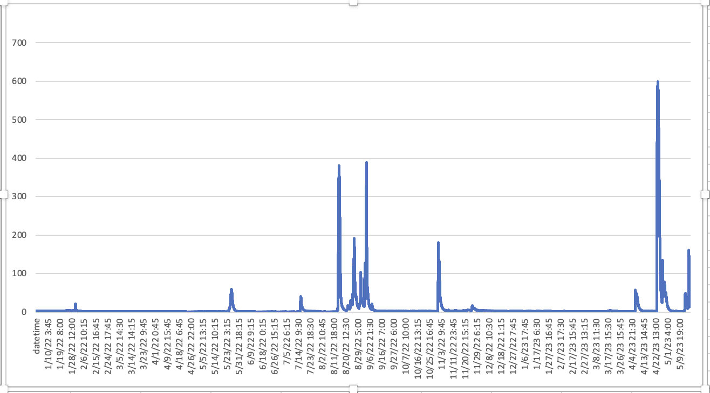
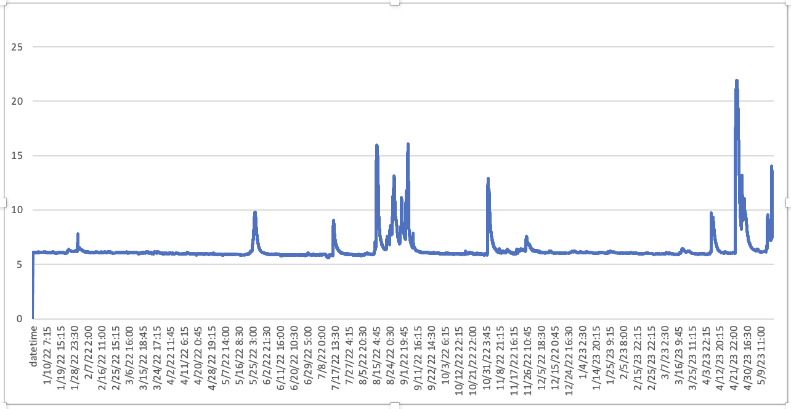

# Case study

We show case how to zoom in on our dataset for a smaller region, taking Texas as an example.

## Study area

 

Left if the whole data area, and right is Texas region.

## Hydrology data

[Corpus Christi, TX - discharge](https://github.com/jiang28/multimodal-geo-dataset.github.io/blob/master/nwis.waterservices.usgs.gov_Discharge.txt)

 

[Corpus Christi, TX - gage height](https://github.com/jiang28/multimodal-geo-dataset.github.io/blob/master/nwis.waterservices.usgs.gov_gage_height.txt)

 

### Hydrology data API

https://waterdata.usgs.gov/blog/nldi-intro/
